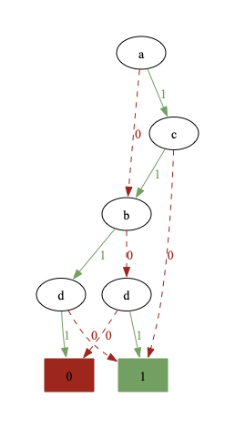
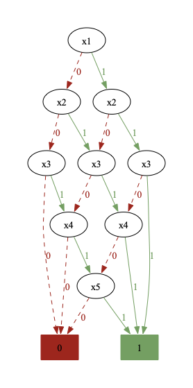
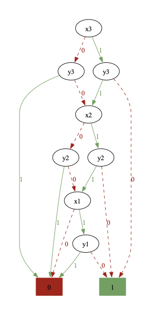
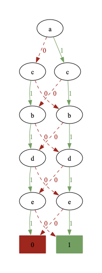

# ROBDD Implementation

**Author:** Omer Burshan
**Course:** Formal Verification and Synthesis - Assignment 3

## Project Structure

```
ROBDD_Project/
├── robdd.py        # Core ROBDD implementation
├── main.py         # Driver script for building ROBDDs
├── task_a.png      # Formula A: (a ∧ ¬c) ∨ (b ⊕ d) - 7 nodes
├── task_b.png      # Formula B: |{x1,x2,x3,x4,x5}| ≥ 3 - 11 nodes
├── task_c.png      # Formula C: x > y (3-bit) - 10 nodes
└── task_d.png      # Additional: (p → q) ∧ (q → r) - 6 nodes
```

## Functionality

### Core Classes

**`Node`**: Represents a BDD node with id, variable, left/right children

**`ROBDD`**: Main class implementing:
- `construct_bdd(formula, var_order)` - Builds ROBDD using Shannon decomposition
- `create_or_find_node()` - Applies reduction rules (redundancy elimination & node sharing)
- `export_to_dot()` - Generates DOT format for visualization
- `render_to_file()` - Saves DOT file
- `render_to_image()` - Generates PNG image
- `node_count()` - Returns total nodes

### Key Features
- Shannon decomposition for recursive construction
- Two reduction rules for canonical representation
- Supports string expressions and Python functions
- DOT/PNG visualization output

## How to Run

```bash
python3 main.py
```

This generates DOT files and PNG images for all 4 formulas.

## Results Summary

| Formula | Variables | Order | Nodes |
|---------|-----------|-------|-------|
| (a ∧ ¬c) ∨ (b ⊕ d) | a,b,c,d | a>c>b>d | 7 |
| At least 3 true | x1-x5 | x1>x2>x3>x4>x5 | 11 |
| x > y (3-bit) | x1-x3,y1-y3 | x3>y3>x2>y2>x1>y1 | 10 |
| (p → q) ∧ (q → r) | p,q,r | p>q>r | 6 |

## Visualizations





